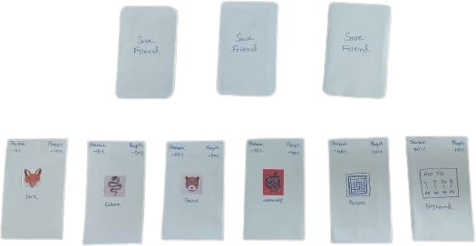

<!-- Title Slide -->

# ESCAPE FROM SHABAH

By:- The Creators

---

<!-- Overview Slide -->

<h3 align="left">Overview :-</h3>
 
<ul align="left" class="small-text">
    <li>Escape from shabah is a adventure board game</li>
     
    <li>The objective or goal of the game is to reach the end by avoiding traps with all players surviving till the end.</li>
</ul>

---

<!-- Components Slide -->

<h3 align="left">Components :-</h3>

<ol align="left" class="small-text">
    <li><u>Game Board</u> :- It is a variant of snake and ladders board, which consists of 75 spaces including traps and events.</li>
     
    <li><u>Pieces</u> :- 4 Player token, the 5th Player doesn't get a token.</li>
     
    <li><u>Dice</u> :- Standard six dice is used, we ignore 4 and 6 in the dice.</li>
     
    <li><u>Cards</u> :- 
        <ul>
            <li>9 Cards</li>
            <li>Shabah (6 Cards)</li>
            <li>Players (3 Cards, one card per player, 4th player doesn't get any cards).</li>
        </ul>
    </li>
</ol>

---

---

<!-- Shabah Slide -->

<h3 align="left">Shabah :-</h3>

Before the game begins, player will roll the dice until the player who rolls 1 he/she will be shabah.

Then shabah holds 6 cards with him.

<h5 align="left"><u>Those are:-</u></h5>
<ol align="left" class="ul-small-text">
    <li>Fox Card</li>
    <li>Cobra Card</li>
    <li>Bear Card</li>
    <li>Werewolf Card</li>
    <li>Prison Card</li>
    <li>Big Hand Card</li>
</ol>

---

<!-- Cards Slides -->

<h3 align="left">Fox Card :-</h3>

When <b>Shabah</b> uses <b>Fox Card</b> shabah's strength will decrease -5% from 100% and <b>Players</b> have damage of -10% from 100%.

<h3 align="left">Corba Card :-</h3>

<b>Shabah</b> 15% and <b>Player</b> 20%.

---

<h3 align="left">Bear Card :-</h3>

<b>Shabah</b> 25% and <b>Player</b> 30%.

<h3 align="left">Werewolf Card :-</h3>

<b>Shabah</b> 35% and <b>Player</b> 40%.

---

<h3 align="left">Prison Card :-</h3>

<b>Shabah</b> can send Player to prison but <b>Shabah will lose 45% strength and the Player doesn't get the hurt</b>.

<h3 align="left">Big Hand Card :-</h3>

By using this card, To use this card Shabah needs to have 50% or more strength and the Players at the end should be 3 or more. the places which the players need to go are given in the card.

---

---

<!-- Player Slide-->

<h3 align="left">Players :-</h3>

The 4 and 6 are ignored.

Each Player has to roll 5 to start the game.

Players to move according to dice.

There will be traps and animals that will make the Players lost health. Each trap will do (-10%) damage. except Fox (-5%) damage.

---

<!-- Save Friend Card -->

<h3 align="left">Save Friend Card :-</h3>

These are the 3 cards given to the Player to save their friends. If a Player lands on the save point, he can then use the Save Friend Card. If there is a Player(s) stuck in a trap then he can same 1 Player.

If there are 3 Players at the end and the 4th Player is in a trap. They can save the Player. The person who has the Save Friend Card they can roll the dice. The number spicfied to save the Player is discussed by the 4 Players.

The place gets one chance only ,If the Player(s) rolls the Player trapped is able to get out. If the player(s) doesn't get the numbers specified then the Player is abandoned.

---

<!-- Selffishness -->

<h3 align="left">Selfishness :-</h3>

The Player can choose to the selfish.

If the shabah choose a Player or when Player is going to go to prison or a trap. The Player can choose another Player to swap position and take in the event.

---

<!-- Ending Slide -->

<h3 align="left">Ending :-</h3>

<h5 align="left">True Ending :-</h5>

If there are 4 Players at the end without shabah then they win. and beat the game.

<h5 align="left">Sade Ending/Partial Ending :-</h5>

If there are 4 Players at the end and they couldn't save the Player(s), then they win but did not complete the game(To actually complete the game Please refer to True Ending).

---

<!-- Mobile Slide -->

<h3 align="left">Mobile :-</h3>
<li align="left" class="small-text">Touch controls for rolling of dice, selecting of cards and navigating through the game board.</li>
<li align="left" class="small-text">Online Multiplayer so players can play with their friends.</li>
<li align="left" class="small-text">Adding Cross-Platform so that Console,PC and Mobile Players can play together.</li>

---

<!-- PC Slide -->

<h3 align="left">PC :-</h3>
<li align="left" class="small-text">Keyboard and Mouse support or only Keyboard gameplay as well</li>
<li align="left" class="small-text">Game can be available on Steam with achivements</li>
<li align="left" class="small-text">Adding Cross-Platform so that Console,PC and Mobile Players can play together.</li>

---

---

<!-- Console Slide -->

<h3 align="left">PS5 :-</h3>
<li align="left" class="small-text">Online Multiplayer so players can play with their friends.</li>
<li align="left" class="small-text">Adding Cross-Platform so that Console,PC and Mobile Players can play together.</li>

---

---

<h3 align="left">XBOX :-</h3>
<li align="left" class="small-text">Online Multiplayer so players can play with their friends.</li>
<li align="left" class="small-text">Adding Cross-Platform so that Console,PC and Mobile Players can play together.</li>

---

---

Our team has really put a lot of effort into making the board game come to it's true life.

I want to Thank my team members for doing what they can.

---

    
Azmal for the Main Board Game idea and figuring out the gameplay mechanics.
 <!-- I saw him work hard to make the board game by hand. -->
    
Shah Mohammad and Armaan gave the idea for Save Point and Prison mechanic.
 <!-- They gave suggestions while we both formulated -->
    
Abdur Rahman gave the Name of the board game and End of the game gameplay mechanic.
 <!-- This is an lie actually. -->
    
Yohib Hussain(who is writing this) made the document and digital presentation for this including the diagrams.
 <!-- You know who wrote these comments. -->

---

<h3 align="left">Technologies used:-</h3>
 

<a href="https://marp.app/">Marp</a> for Presentation

<a href="https://www.figma.com">Figma</a> for designing the Control Diagrams.
